# PR3_II_KyliamChinea

## De que trata la practica

Esta práctica explora el **sistema de física de Unity** mediante 9 situaciones que demuestran cómo interactúan objetos con Rigidbody, Colliders y diferentes configuraciones (estáticos, dinámicos, cinemáticos, triggers). Además, incluye 5 ejercicios prácticos sobre control de personajes, colisiones, triggers, capas de colisión y materiales físicos.

**Objetivos principales:**
- Comprender el comportamiento de Rigidbody (dinámico vs cinemático)
- Dominar colisiones físicas y eventos trigger
- Aplicar Physic Materials para controlar fricción y rebote
- Configurar capas y la Layer Collision Matrix para interacciones selectivas

---

##  Índice

- [Situaciones (1 - 9)](#situaciones-1---9)
  - [Situación 1](#situación-1)
  - [Situación 2](#situación-2)
  - [Situación 3](#situación-3)
  - [Situación 4](#situación-4)
  - [Situación 5](#situación-5)
  - [Situación 6](#situación-6)
  - [Situación 7](#situación-7)
  - [Situación 8](#situación-8)
  - [Situación 9](#situación-9)
- [Ejercicios propuestos (1 - 5)](#ejercicios-propuestos-1---5)
  - [Ejercicio 1 — Personaje con Rigidbody y control total](#ejercicio-1--personaje-con-rigidbody-y-control-total)
  - [Ejercio 2 — Colisiones y cambio de color](#ejercicio-2--colisiones-y-cambio-de-color)
  - [Ejercicio 3 — Zona trigger que altera estado](#ejercicio-3--zona-trigger-que-altera-estado)
  - [Ejercicio 4 — Capas y Layer Collision Matrix](#ejercicio-4--capas-y-layer-collision-matrix)
  - [Ejercicio 5 — Physic Materials y fuerzas](#ejercicio-5--physic-materials-y-fuerzas)
- [Conclusiones y recomendaciones](#conclusiones-y-recomendaciones)

---

## Situaciones (1 - 9)

Para cada situación se describe qué objetos son físicos (con Rigidbody), cuáles sólo tienen Collider y cómo se comportan en la escena.

### Situación 1
- **Descripción:** El plano no es un objeto físico. La esfera es un objeto físico y el cubo no.
- **Configuración:** El plano y el cubo sólo tienen Collider; la esfera tiene Rigidbody (dinámico).
- **Resultado esperado:** La esfera cae y colisiona con el plano; el cubo permanece estática si no tiene Rigidbody.
- **GIF:** 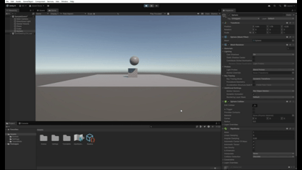

### Situación 2
- **Descripción:** El plano no es un objeto físico. El cubo es un objeto físico y la esfera también.
- **Configuración:** El plano sólo tiene Collider; el cubo y la esfera tienen Rigidbody (dinámicos).
- **Resultado esperado:** Ambos objetos reaccionan a la gravedad y colisionan entre sí y con el plano.
- **GIF:** 

### Situación 3
- **Descripción:** El plano no es un objeto físico. El cubo es un objeto físico y la esfera es cinemática.
- **Configuración:** El plano sólo tiene Collider; el cubo tiene Rigidbody dinámico; la esfera tiene Rigidbody con IsKinematic = true.
- **Resultado esperado:** El cubo es afectado por fuerzas y gravedad; la esfera sólo colisiona pero no es afectada por la física (se mueve sólo vía transform o animaciones).
- **GIF:** 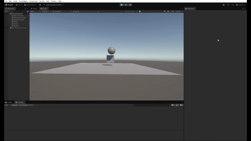

### Situación 4
- **Descripción:** El plano es un objeto físico. El cubo es un objeto físico y la esfera es física.
- **Configuración:** Todos llevan Rigidbody (dinámicos) y Colliders.
- **Resultado esperado:** Interacciones físicas completas entre todos los objetos. El plano con Rigidbody va a caer si no está anclado.
- **GIF:** 

### Situación 5
- **Descripción:** El plano es un objeto físico. El cubo es un objeto físico y la esfera es física con 10 veces más masa que el cubo.
- **Configuración:** Todos con Rigidbody; ajustar la masa de la esfera a 10 veces la masa del cubo.
- **Resultado esperado:** Al colisionar, la esfera domina el intercambio de momento; el cubo se ve más afectado por las colisiones, si embargo caen igual todos.
- **GIF:** 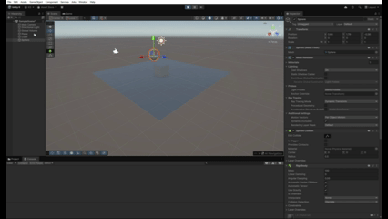

### Situación 6
- **Descripción:** El plano es un objeto físico. El cubo es un objeto físico y la esfera es física con 100 veces más masa que el cubo.
- **Configuración:** Todos con Rigidbody; masa de esfera = 100x masa del cubo.
- **Resultado esperado:** La esfera apenas se ve afectada por colisiones con el cubo; el cubo sufre cambios importantes en velocidad/dirección, vuelve a no notarse poruqe caen todos por igual.
- **GIF:** 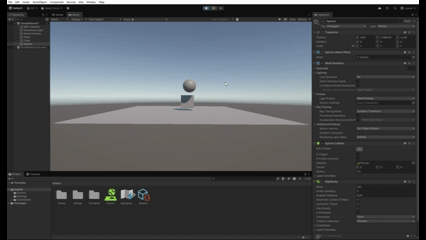

### Situación 7
- **Descripción:** El plano es un objeto físico. El cubo es un objeto físico y la esfera es física con fricción.
- **Configuración:** Todos con Rigidbody; asignar Physic Material con fricción alta a la esfera (o al plano) según la prueba.
- **Resultado esperado:** Se observa cómo la esfera rueda o se detiene más rápido según el material.
- **GIF:** 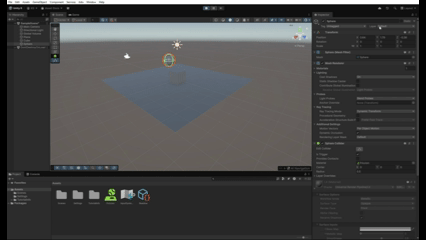

### Situación 8
- **Descripción:** El plano es un objeto físico. El cubo es un objeto físico y la esfera no es física y es Trigger.
- **Configuración:** Todos con Rigidbody (el plano y el cubo dinámicos o cinemáticos según diseño), la esfera con Collider marcado Is Trigger = true. Nota: para que los triggers funcionen, al menos uno de los objetos debe tener Rigidbody.
- **Resultado esperado:** La esfera no interfiere físicamente con otros objetos, pero dispara eventos OnTriggerEnter/Exit cuando otros objetos entran en su volumen, no se ve porque los otros dos caen.
- **GIF:** 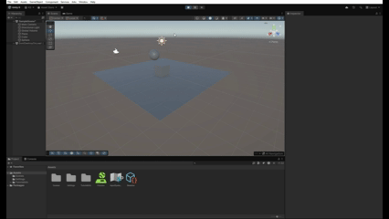

### Situación 9
- **Descripción:** El plano es un objeto físico. El cubo es un objeto físico y la esfera es física y es Trigger.
- **Configuración:** Todos con Rigidbody; la esfera tiene Collider con Is Trigger = true y Rigidbody.
- **Resultado esperado:** La esfera genera eventos de trigger cuando otros objetos entran/salen de su volumen. Dependiendo de cómo esté configurada, igualmente es afectada por la gravedad y caen todos moverse físicamente o no.
- **GIF:** 
---

## Ejercicios propuestos (1 - 5)

Estos ejercicios son prácticos y están pensados para implementarse en Unity con scripts C#.

### Ejercicio 1 — Personaje con Rigidbody y control total
- **Objetivo:** Crear un personaje controlado con WASD o flechas. El movimiento debe usar un Rigidbody (AddForce o manipulación directa de velocity), pero manteniendo el control total.
- **Puntos clave:**
  - Usar Rigidbody para que el personaje colisione correctamente con otros cuerpos.
  - Mantener el control completo: usar `Rigidbody.velocity` o `Rigidbody.MovePosition` para evitar acumulaciones de fuerza indeseadas.
  - Alternativamente, usar `AddForce` con un factor de amortiguamiento para mantener control responsivo.
- **Comprobación:** Mover al personaje con WASD/flechas y observar colisiones físicas sin perder control del movimiento.
- **GIF:** 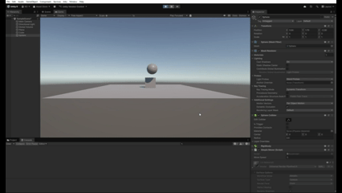

**Código:**
```csharp
using UnityEngine;


public class Excercise3 : MonoBehaviour
{
    public float moveSpeed = 5f;
    public Rigidbody rb;

    void Start()
    {
        rb = GetComponent<Rigidbody>();
        if (rb == null)
            Debug.LogWarning("¡Rigidbody no encontrado! Añade un Rigidbody para que el movimiento con física funcione.");
    }

    void FixedUpdate()
    {
        if (rb != null)
        {
            float h = Input.GetAxis("Horizontal");
            float v = Input.GetAxis("Vertical");
            Vector3 movement = new Vector3(h, 0f, v);
           
            if (movement.sqrMagnitude > 0f)
            {
                Vector3 newPosition = rb.position + movement.normalized * moveSpeed * Time.fixedDeltaTime;
                rb.MovePosition(newPosition);
            }
        }
    }
}
```

### Ejercicio 2 — Colisiones y cambio de color
- **Objetivo:** Crear varios cubos o esferas con Rigidbody dinámico. Al colisionar, mostrar por consola el nombre del objeto con el que colisiona y cambiar su color.
- **Puntos clave:**
  - Implementar `OnCollisionEnter` en un script que obtenga `collision.gameObject.name`.
  - Cambiar `renderer.material.color` al colisionar.
  - Asegurarse de que los objetos tengan Rigidbody y Colliders apropiados.
- **GIF:** 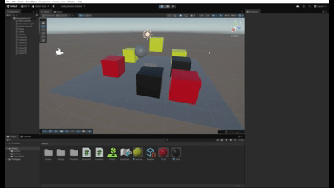

**Código:**
```csharp
using UnityEngine;

public class Excercise2 : MonoBehaviour
{
    public float moveSpeed = 5f;
    Rigidbody rb;
    Vector3 inputDir;
    Renderer rend;

    void Start()
    {
        rb = GetComponent<Rigidbody>();
        rend = GetComponent<Renderer>();
    }

    void Update()
    {
        float h = Input.GetAxisRaw("Horizontal");
        float v = Input.GetAxisRaw("Vertical");
        inputDir = new Vector3(h, 0f, v);
    }

    void FixedUpdate()
    {
        moveCharacter(inputDir);
    }


    void moveCharacter(Vector3 direction)
    {
        float y = rb.linearVelocity.y;
        rb.linearVelocity = direction * moveSpeed;
        rb.linearVelocity = new Vector3(rb.linearVelocity.x, y, rb.linearVelocity.z);
    }

    void OnCollisionEnter(Collision collision)
    {
        Debug.Log(gameObject.name + " collided with " + collision.gameObject.name);

        if (rend != null)
        {
            Color color = Color.gray;
            Renderer otherRend = collision.gameObject.GetComponent<Renderer>();
            if (otherRend != null)
            {
                color = otherRend.material.color;
            }
            rend.material.color = color;
        }
    }
}

```

### Ejercicio 3 — Zona trigger que altera estado
- **Objetivo:** Crear una zona (por ejemplo, un cubo grande con Is Trigger = true). Al entrar, cambiar el color del personaje o activar un efecto de luz; al salir, revertir el cambio. Añadir otra zona que aumente una variable 'daño'.
- **Puntos clave:**
  - Usar `OnTriggerEnter/Exit` para detectar entradas/salidas.
  - Mantener estado para revertir cambios correctamente (guardar el color original, por ejemplo).
  - Implementar una variable pública o serializada para el daño y mostrarla en consola o UI.
- **Comprobación:** Entrar/salir de las zonas y observar efectos visuales y mensajes en consola.
- **GIF:** 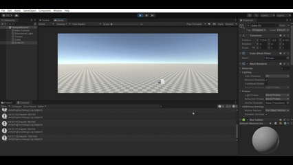
**Código:**
```csharp
using UnityEngine;


public class Excercise3 : MonoBehaviour
{
    public float moveSpeed = 5f;


    public float maxHealth = 100f;
    public float currentHealth = 100f;
    public float stepAmount = 5f;
    public float tickInterval = 0.5f;


    public Color zoneColor = Color.red;
    public string zoneTag = "zone";


    private Renderer rend;
    private Color originalColor;
    private bool inZone = false;
    private Rigidbody rb;


    private float tickTimer = 0f;


    void Start()
    {
        rb = GetComponent<Rigidbody>();
        if (rb == null)
            Debug.LogWarning("¡Rigidbody no encontrado! Añade un Rigidbody para que el movimiento con física funcione.");


        rend = GetComponent<Renderer>();
        if (rend != null)
            originalColor = rend.material.color;
        else
            Debug.LogWarning("Renderer not found on this GameObject.");


        currentHealth = Mathf.Clamp(currentHealth, 0f, maxHealth);
    }


    void Update()
    {
        // Temporizador para ticks de salud
        tickTimer += Time.deltaTime;
        while (tickTimer >= tickInterval)
        {
            tickTimer -= tickInterval;


            if (inZone && currentHealth > 0f)
            {
                currentHealth = Mathf.Max(0f, currentHealth - stepAmount);
                Debug.Log($"Health: {currentHealth}/{maxHealth}");
            }
            else if (!inZone && currentHealth < maxHealth)
            {
                currentHealth = Mathf.Min(maxHealth, currentHealth + stepAmount);
                Debug.Log($"Health: {currentHealth}/{maxHealth}");
            }
        }
    }


    void FixedUpdate()
    {
        if (rb != null)
        {
            float h = Input.GetAxis("Horizontal");
            float v = Input.GetAxis("Vertical");
            Vector3 movement = new Vector3(h, 0f, v);
           
            if (movement.sqrMagnitude > 0f)
            {
                Vector3 newPosition = rb.position + movement.normalized * moveSpeed * Time.fixedDeltaTime;
                rb.MovePosition(newPosition);
            }
        }
    }


    void OnTriggerEnter(Collider other)
    {
        if (!other.CompareTag(zoneTag)) return;


        if (!inZone)
        {
            inZone = true;
            if (rend != null) rend.material.color = zoneColor;
            tickTimer = 0f;
        }
    }


    void OnTriggerExit(Collider other)
    {
        if (!other.CompareTag(zoneTag)) return;


        if (inZone)
        {
            inZone = false;
            if (rend != null) rend.material.color = originalColor;
            tickTimer = 0f;
        }
    }
}

```

### Ejercicio 4 — Capas y Layer Collision Matrix
- **Objetivo:** Crear tres tipos de objetos en capas distintas: Jugador, Enemigos, Recolectables. Configurar la Layer Collision Matrix (Project Settings > Physics). Hacer que los enemigos solo colisionen con el jugador, y que los recolectables solo sean detectados por triggers.
- **Puntos clave:**
  - En Project Settings > Physics, deshabilitar colisiones entre capas no deseadas.
  - Asignar cada objeto a su capa correspondiente.
  - Los recolectables pueden tener Is Trigger = true y detectarse con OnTriggerEnter.
- **Comprobación:** Probar interacciones y asegurarse que solo suceden las colisiones/detecciones deseadas.
- **GIF:** 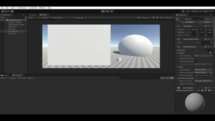
**Configuración de la Layer Collision Matrix:**

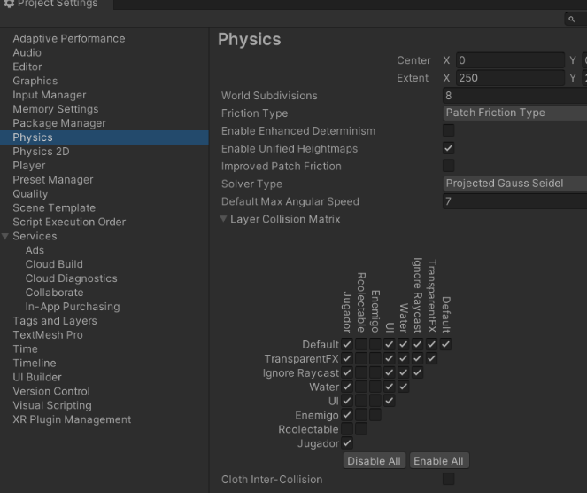

### Ejercicio 5 — Physic Materials y fuerzas
- **Objetivo:** Crear una escena con distintos materiales físicos (resbaladizo, rugoso, rebote alto). Aplicar distintos Physic Materials a objetos. Lanzar los objetos con AddForce() al pulsar la tecla X y observar cómo cambian las reacciones.
- **Puntos clave:**
  - Crear Physic Materials con diferentes valores de bounciness (rebote) y fricción (dynamic/static friction).
  - Aplicar los materiales a los Colliders de los objetos, que tengan collision y demás configuración para que los materiales colisionen y se genere la reacción.
  - Usar `Input.GetKeyDown(KeyCode.X)` para lanzar objetos con `AddForce`.
- **GIF:** 
**Código:**
```csharp
using UnityEngine;


public class Excercise5 : MonoBehaviour
{
    public GameObject rugoso;
    public GameObject rebote;
    public GameObject resbaloso;
   
    public float fuerzaLanzamiento = 500f;
    public Vector3 direccionFuerza = new Vector3(0, 1, 1);
   
    void Start()
    {
        rugoso = GameObject.FindGameObjectWithTag("rugoso");
        rebote = GameObject.FindGameObjectWithTag("rebote");
        resbaloso = GameObject.FindGameObjectWithTag("resbaloso");
        if (rugoso == null)
            Debug.LogWarning("¡No se encontró el objeto con etiqueta 'rugoso'! Añade la etiqueta en Unity.");
        else
            Debug.Log($"Objeto RUGOSO encontrado: {rugoso.name}");
           
        if (rebote == null)
            Debug.LogWarning("¡No se encontró el objeto con etiqueta 'rebote'! Añade la etiqueta en Unity.");
        else
            Debug.Log($"Objeto REBOTE encontrado: {rebote.name}");
           
        if (resbaloso == null)
            Debug.LogWarning("¡No se encontró el objeto con etiqueta 'resbaloso'! Añade la etiqueta en Unity.");
        else
            Debug.Log($"Objeto RESBALOSO encontrado: {resbaloso.name}");
    }


    void Update()
    {
        if (Input.GetKeyDown(KeyCode.R) && rugoso != null)
        {
            LanzarObjeto(rugoso, "RUGOSO");
        }
        if (Input.GetKeyDown(KeyCode.E) && rebote != null)
        {
            LanzarObjeto(rebote, "REBOTE");
        }
        if (Input.GetKeyDown(KeyCode.T) && resbaloso != null)
        {
            LanzarObjeto(resbaloso, "RESBALOSO");
        }
    }
   
    void LanzarObjeto(GameObject obj, string nombre)
    {
        Rigidbody rb = obj.GetComponent<Rigidbody>();
       
        if (rb != null)
        {
            rb.velocity = Vector3.zero;
            rb.angularVelocity = Vector3.zero;
           
            rb.AddForce(direccionFuerza * fuerzaLanzamiento);
           
            Debug.Log($"¡Objeto {nombre} lanzado con {fuerzaLanzamiento} de fuerza!");
        }
        else
        {
            Debug.LogError($"El objeto {nombre} no tiene Rigidbody. ¡Añade un Rigidbody!");
        }
    }
}

```

---

## Conclusiones y recomendaciones

- **Rigidbody vs Collider:** Usa objetos estáticos (sin Rigidbody) para suelo y objetos inmóviles que no necesitan moverse por la física; reserva Rigidbody para objetos que deban responder a fuerzas, gravedad y colisiones dinámicas.
  
- **Cinemática:** Un Rigidbody cinemático es útil para objetos animados por código que deben empujar cuerpos dinámicos sin ser afectados por fuerzas externas (por ejemplo, plataformas móviles).

- **Masa y momento:** La masa relativa de los cuerpos altera completamente el intercambio de velocidad en colisiones. Experimenta con masas 10x y 100x para observar cómo un objeto ligero rebota violentamente mientras uno pesado apenas se inmuta, no obstante caen con la misma velocidad, ya que están en el vacio.

- **Fricción y bounciness:** Los Physic Materials permiten afinar el comportamiento de deslizamiento y rebote sin necesidad de tocar scripts. Un material resbaladizo (fricción baja) hará que los objetos patinen; un material con alto rebote (bounciness alto) los hará rebotar repetidamente. Es muy interesante para el proyecto final

- **Triggers:** Para detectar presencia sin interacción física (por ejemplo, zonas de daño, puntos de control), usa colliders con Is Trigger = true. Recuerda que las callbacks de trigger (`OnTriggerEnter/Exit/Stay`) requieren que al menos uno de los objetos involucrados tenga un Rigidbody, posible fallo del que percatarse si no ocurre nada.

- **Capas y colisiones selectivas:** Usa la Layer Collision Matrix para optimizar rendimiento y controlar qué objetos interactúan físicamente entre sí. Esto es especialmente útil para interacciones complejas con muchos tipos de objetos en el posible proyecto final.

---
